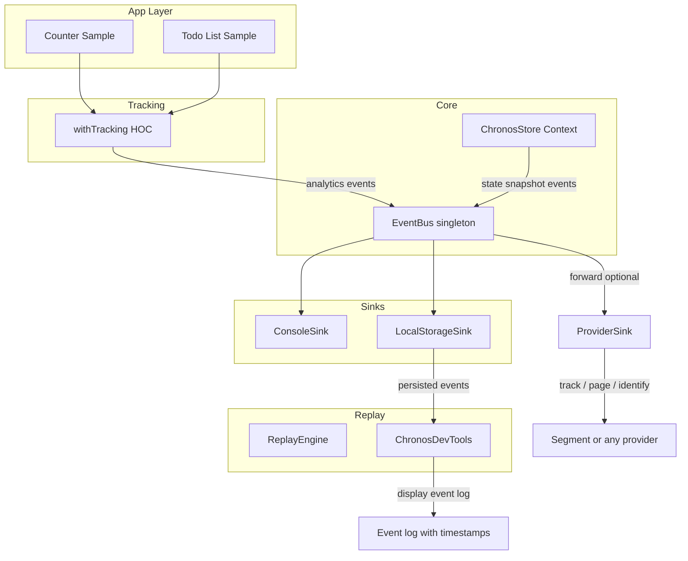

# Chronos Analytics — Agent Guide

This file is the single source of truth for building and evolving the **Chronos** analytics framework. Follow it when implementing features, fixing bugs, or refactoring.

---

## 1. What Chronos Is

- **Chronos** is an NPM library: "Event Sourcing for the Frontend." It provides high-fidelity event tracking and **replay as event logs with timestamps** (no state re-hydration).
- **Library** (publishable): lives under `src/`, builds to `dist/`. React is a **peerDependency**.
- **Demo app** (not published): `examples/demo/` — Vite React app that consumes the local package (link or workspace) to verify event logging and persistence (Counter + Todo).

**Basic use case (recommended):** Use the **`useChronos`** hook in any component to get `emit`. No reducer or store required. Bootstrap once: register sinks (LocalStorageSink, ConsoleSink) and optionally `createProviderSink(segmentAdapter)`. In components: `const { emit } = useChronos(); emit('button_click', { id: 'submit' });` Events flow to the EventBus and all sinks. Use `withTracking` for automatic click events.

**Replay:** Replay means **displaying event logs with timestamps** in ChronosDevTools. It does not mean re-playing state changes or scrubbing the app UI. DevTools shows a list of events (timestamp, eventName, payload); events are persisted in localStorage. Optional: use `createChronosStore` for app state and state_snapshot events (those appear in the log too).

**Basic usage example (emit only):**

```tsx
import { useChronos } from 'chronos-analytics'

function SubmitButton() {
  const { emit } = useChronos()
  const handleClick = () => {
    emit('button_click', { action: 'submit', formId: 'contact' })
    // ... then do actual submit
  }
  return <button onClick={handleClick}>Submit</button>
}
```

---

## 2. Architecture



- **EventBus** is the backbone: all events flow through it. Sinks subscribe and do not depend on each other.
- **useChronos** is the primary API for emitting events: returns `{ emit }`. No store or reducer required for basic tracking.
- **ChronosStore** (optional) emits a `state_snapshot` event on every state change; those events appear in the event log like any other.
- **ChronosDevTools** displays the event log (timestamp, eventName, payload) from localStorage; no state scrubber or play/pause.
- **ProviderSink** (from `createProviderSink`) forwards live events to external analytics (e.g. Segment).

---

## 3. SOLID and Analytics Provider Agnostic

- **Goal:** Chronos supports any analytics service (Segment, GTM, Mixpanel). The library never imports Segment or any vendor.
- **Single Responsibility:** Chronos = event bus + state snapshots + replay. Adapters = translate and send to external services.
- **Open/Closed:** New analytics = new sinks or new `IAnalyticsProvider` implementations; no change to EventBus or core.
- **Liskov:** Any sink implements `(event: AnalyticsEvent) => void`. Any provider implements `IAnalyticsProvider`.
- **Interface Segregation:** Small interfaces: `EventSink` and `IAnalyticsProvider` (track, optional page/identify/group).
- **Dependency Inversion:** Chronos depends only on `EventSink` and optionally `IAnalyticsProvider`. The app injects Segment via `createProviderSink(adapter)`.

**Segment integration in a host app:** Keep the existing `Analytics` class. Add an adapter that implements `IAnalyticsProvider` (delegate to `analytics.track()`, `analytics.page()`, etc.). On init: `eventBus.subscribe(createProviderSink(segmentAdapter, { filter: (e) => e.eventName !== "state_snapshot" }))`.

---

## 4. Types and Contracts

- **AnalyticsEvent:** `id`, `timestamp`, `eventName`, `payload`, `metadata?`. All events (including state_snapshot) use this shape.
- **State snapshot:** `eventName === "state_snapshot"`, `payload: { state: unknown }`. Emitted by ChronosStore; provider sinks should skip these. Shown in event log like other events.
- **EventSink:** `type EventSink = (event: AnalyticsEvent) => void` — contract for `EventBus.subscribe(sink)`.
- **IAnalyticsProvider:** `track(eventName, properties)`; optional `trackBatch?(events)`, `page?`, `identify?`, `group?`. Implemented by the app (e.g. Segment adapter); Chronos consumes it via `createProviderSink(provider)` or `createBatchedProviderSink(provider)` for async/batch sending.

---

## 5. Package and Build

- **Root** = NPM package. `package.json`: `name`, `main`, `module`, `types`, `exports`, `peerDependencies` (react, react-dom), `files: ["dist"]`.
- **Vite** in library mode: entry `src/index.ts`, output `dist/`, ESM + CJS, generate `.d.ts` (e.g. vite-plugin-dts).
- **Folders:** `src/lib`, `src/hoc`, `src/components`, `src/types`. Single public entry: `src/index.ts` re-exporting the API.
- **TypeScript:** Strict mode. No React bundled; host app supplies React.

---

## 6. Module Responsibilities

| Module | Responsibility |
|--------|-----------------|
| **EventBus** | Singleton: `emit(event)`, `subscribe(sink) => unsubscribe`. Synchronous broadcast to all sinks. |
| **useChronos** | Hook: returns `{ emit(eventName, payload?, metadata?) }`. Uses EventBus singleton. **Primary API** for basic use — no reducer/store. |
| **ConsoleSink** | `init(eventBus)` — log each event asynchronously (e.g. dev only). |
| **LocalStorageSink** | `init(eventBus, { key?, maxEvents? })` — append events to localStorage; cap size. |
| **createProviderSink** | `(provider, options?) => EventSink`. Always async. Skip state_snapshot; forward to `provider.track`. On page unload or offline, unsent events stored in localStorage (option: `unsentEventsStorageKey`); replayed on load/online. Options: `filter`, `mapToTrack`, `unsentEventsStorageKey`. |
| **createBatchedProviderSink** | `(provider, options?) => EventSink`. Queue and send in batches asynchronously; same unload/offline → localStorage → replay on load/online. Options: same as createProviderSink plus `batchSize`, `flushIntervalMs`, `useIdleCallback`. Use with `trackBatch` (e.g. Segment /v1/batch) for fewer requests. |
| **ChronosStore** | (Optional.) `createChronosStore<S, A>(reducer, initialState)` → `{ ChronosStoreProvider, useChronosStore }`. Emit state_snapshot after every state change (events appear in the log). |
| **withTracking** | HOC: intercept onClick → emit analytics event → call original onClick. |
| **ReplayEngine** | Holds `AnalyticsEvent[]` for display; `load(events)`, `getEvents()`. Used only if building custom event log UIs. |
| **ChronosDevTools** | Fixed overlay: **event log** (timestamp, eventName, payload). Row color by sending status (sent vs pending to provider). Rows with `_chronosSourceId` show "Locate" pill; click to highlight source element. Load from localStorage; Refresh and Clear. No state scrubber. Inline styles. |

---

## 7. File Layout

**Library (published):**

- `src/index.ts` — Re-export EventBus, useChronos, sinks, createProviderSink, createChronosStore, withTracking, ReplayEngine, ChronosDevTools, types.
- `src/types/chronos.ts` — AnalyticsEvent, EventSink, IAnalyticsProvider, snapshot payload type.
- `src/hooks/useChronos.ts` — useChronos() → { emit(eventName, payload?, metadata?) }. Uses getEventBus() under the hood.
- `src/lib/EventBus.ts`
- `src/lib/sinks/ConsoleSink.ts`
- `src/lib/sinks/LocalStorageSink.ts`
- `src/lib/sinks/index.ts` — barrel: re-exports Console, LocalStorage, createProviderSink, createBatchedProviderSink
- `src/lib/sinks/utils.ts` — runAsync, scheduleFlush, isOnline, hasWindow, DEFAULT_UNSENT_STORAGE_KEY
- `src/lib/sinks/providerHelpers.ts` — mapEventToTrackPayload, sendToProvider (shared by provider sinks)
- `src/lib/sinks/unsentEventsStorage.ts` — get/append/clear unsent events in localStorage (unload/offline replay)
- `src/lib/sinks/providerSentStatus.ts` — track which event IDs have been sent to provider; DevTools uses for row styling; optional sessionStorage persistence
- `src/lib/sinks/ConsoleSink.ts`
- `src/lib/sinks/LocalStorageSink.ts`
- `src/lib/sinks/createProviderSink.ts`
- `src/lib/sinks/createBatchedProviderSink.ts`
- `src/lib/ChronosStore.ts`
- `src/lib/ReplayEngine.ts`
- `src/hoc/withTracking.tsx`
- `src/components/ChronosDevTools.tsx`
- `vite.config.ts`, `package.json`

**Demo (not published):**

- `examples/demo/` — Vite React app; dependency on root package (link or workspace).
- `examples/demo/src/App.tsx` — ChronosStoreProvider, Counter, TodoList, ChronosDevTools, sink registration.
- `examples/demo/src/components/Counter.tsx`, `TodoList.tsx` — Use store + withTracking.

---

## 8. Implementation Order

1. Library scaffold: package.json, tsconfig (strict), vite.config (lib mode), folders (lib, hooks, hoc, components, types).
2. Types in `src/types/chronos.ts` (AnalyticsEvent, EventSink, IAnalyticsProvider); export from index.
3. EventBus; **useChronos** hook (returns { emit }); ConsoleSink, LocalStorageSink, createProviderSink; export from index.
4. ChronosStore (optional; createChronosStore, state_snapshot on change); export from index.
5. withTracking HOC; export from index.
6. ReplayEngine (event log: load, getEvents); export from index.
7. ChronosDevTools (event log overlay: timestamp, eventName, payload; Refresh/Clear); export from index.
8. Build; ensure dist/ has JS and d.ts.
9. Demo app: examples/demo, reducer + Counter + TodoList, Provider + DevTools + sinks; verify event log and localStorage persistence.

---

## 9. Conventions for Agents

- **Do not** add Segment (or any vendor) as a dependency of the Chronos package. Provider integration is via `IAnalyticsProvider` and `createProviderSink` in the host app.
- **Do** keep state and event payloads serializable (no functions) so replay and localStorage work.
- **Do** export all public types and the listed API from `src/index.ts` only; avoid deep imports for consumers.
- **Do** use React 18+ and TypeScript strict mode. Prefer functional components and hooks.
- When adding a new sink or provider type, extend via new modules and the existing EventSink / IAnalyticsProvider contracts; do not change EventBus or store core behavior.
