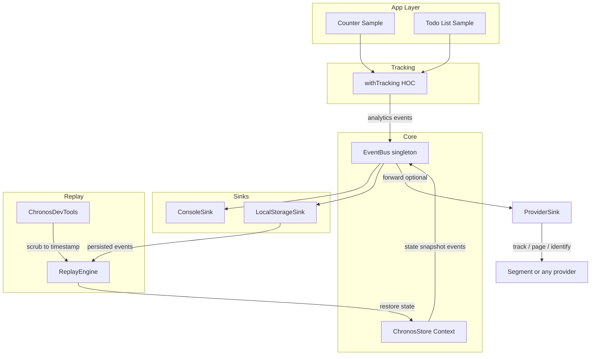

# Chronos Analytics — Agent Guide

This file is the single source of truth for building and evolving the **Chronos** analytics framework. Follow it when implementing features, fixing bugs, or refactoring.

---

## 1. What Chronos Is

- **Chronos** is an NPM library: "Event Sourcing for the Frontend." It provides high-fidelity event tracking and a "Time Machine" replay without Redux.
- **Library** (publishable): lives under `src/`, builds to `dist/`. React is a **peerDependency**.
- **Demo app** (not published): `examples/demo/` — Vite React app that consumes the local package (link or workspace) to verify replay and persistence (Counter + Todo).

**Consumer usage:** `npm i chronos-analytics`. Register sinks (LocalStorageSink, ConsoleSink). To forward to Segment or any provider: implement `IAnalyticsProvider` with an adapter and subscribe `eventBus.subscribe(createProviderSink(segmentAdapter))`. Create store with `createChronosStore(reducer, initialState)`, wrap app with Provider, use `withTracking` on clickables, optionally render ChronosDevTools.

---

## 2. Architecture

- **EventBus** is the backbone: all events flow through it. Sinks subscribe and do not depend on each other.
- **ChronosStore** emits a `state_snapshot` event on every state change so ReplayEngine can re-hydrate.
- **ProviderSink** (from `createProviderSink`) forwards live events to external analytics (e.g. Segment); replay is Chronos-only.

---

## 3. SOLID and Analytics Provider Agnostic

- **Goal:** Chronos supports any analytics service (Segment, GTM, Mixpanel). The library never imports Segment or any vendor.
- **Single Responsibility:** Chronos = event bus + state snapshots + replay. Adapters = translate and send to external services.
- **Open/Closed:** New analytics = new sinks or new `IAnalyticsProvider` implementations; no change to EventBus or core.
- **Liskov:** Any sink implements `(event: AnalyticsEvent) => void`. Any provider implements `IAnalyticsProvider`.
- **Interface Segregation:** Small interfaces: `EventSink` and `IAnalyticsProvider` (track, optional page/identify/group).
- **Dependency Inversion:** Chronos depends only on `EventSink` and optionally `IAnalyticsProvider`. The app injects Segment via `createProviderSink(adapter)`.

**Segment integration in a host app:** Keep the existing `Analytics` class. Add an adapter that implements `IAnalyticsProvider` (delegate to `analytics.track()`, `analytics.page()`, etc.). On init: `eventBus.subscribe(createProviderSink(segmentAdapter, { filter: (e) => e.eventName !== "state_snapshot" }))`.

---

## 4. Types and Contracts

- **AnalyticsEvent:** `id`, `timestamp`, `eventName`, `payload`, `metadata?`. All events (including state_snapshot) use this shape.
- **State snapshot:** `eventName === "state_snapshot"`, `payload: { state: unknown }`. ReplayEngine uses `payload.state`; provider sinks should skip these.
- **EventSink:** `type EventSink = (event: AnalyticsEvent) => void` — contract for `EventBus.subscribe(sink)`.
- **IAnalyticsProvider:** `track(eventName, properties)`; optional `page?`, `identify?`, `group?`. Implemented by the app (e.g. Segment adapter); Chronos only consumes this interface via `createProviderSink`.

---

## 5. Package and Build

- **Root** = NPM package. `package.json`: `name`, `main`, `module`, `types`, `exports`, `peerDependencies` (react, react-dom), `files: ["dist"]`.
- **Vite** in library mode: entry `src/index.ts`, output `dist/`, ESM + CJS, generate `.d.ts` (e.g. vite-plugin-dts).
- **Folders:** `src/lib`, `src/hoc`, `src/components`, `src/types`. Single public entry: `src/index.ts` re-exporting the API.
- **TypeScript:** Strict mode. No React bundled; host app supplies React.

---

## 6. Module Responsibilities

| Module | Responsibility |
|--------|-----------------|
| **EventBus** | Singleton: `emit(event)`, `subscribe(sink) => unsubscribe`. Synchronous broadcast to all sinks. |
| **ConsoleSink** | `init(eventBus)` — log each event (e.g. dev only). |
| **LocalStorageSink** | `init(eventBus, { key?, maxEvents? })` — append events to localStorage; cap size. |
| **createProviderSink** | `(provider: IAnalyticsProvider, options?) => EventSink`. Skip state_snapshot; forward others to `provider.track(eventName, payload)`. Options: `filter`, `mapToTrack`. |
| **ChronosStore** | `createChronosStore<S, A>(reducer, initialState)` → `{ ChronosStoreProvider, useChronosStore }`. Emit state_snapshot after every state change. |
| **withTracking** | HOC: intercept onClick → emit analytics event → call original onClick. |
| **ReplayEngine** | Load `AnalyticsEvent[]`; filter state_snapshot; expose `getStateAtIndex(i)`, play/pause/seek/speed. |
| **ReplayContext** | Provide `replayState`, `isReplaying`, controls. When isReplaying, app reads from replay state instead of live store. |
| **ChronosDevTools** | Fixed overlay: scrubber, play/pause, speed. Load events from localStorage; drive ReplayEngine and ReplayContext. Style with inline styles or shipped CSS (no Tailwind dependency for consumers). |

---

## 7. File Layout

**Library (published):**

- `src/index.ts` — Re-export EventBus, sinks, createProviderSink, createChronosStore, withTracking, ReplayEngine, ChronosDevTools, ReplayProvider, types.
- `src/types/chronos.ts` — AnalyticsEvent, EventSink, IAnalyticsProvider, snapshot payload type.
- `src/lib/EventBus.ts`
- `src/lib/sinks/ConsoleSink.ts`
- `src/lib/sinks/LocalStorageSink.ts`
- `src/lib/sinks/createProviderSink.ts`
- `src/lib/ChronosStore.ts`
- `src/lib/ReplayEngine.ts`
- `src/hoc/withTracking.tsx`
- `src/components/ChronosDevTools.tsx`
- `vite.config.ts`, `package.json`

**Demo (not published):**

- `examples/demo/` — Vite React app; dependency on root package (link or workspace).
- `examples/demo/src/App.tsx` — ChronosStoreProvider, ReplayProvider, Counter, TodoList, ChronosDevTools, sink registration.
- `examples/demo/src/components/Counter.tsx`, `TodoList.tsx` — Use store + withTracking.

---

## 8. Implementation Order

1. Library scaffold: package.json, tsconfig (strict), vite.config (lib mode), folders (lib, hoc, components, types).
2. Types in `src/types/chronos.ts` (AnalyticsEvent, EventSink, IAnalyticsProvider); export from index.
3. EventBus; ConsoleSink, LocalStorageSink, createProviderSink; export from index.
4. ChronosStore (createChronosStore, state_snapshot on change); export from index.
5. withTracking HOC; export from index.
6. ReplayEngine + ReplayContext; export from index.
7. ChronosDevTools (overlay, scrubber, inline or shipped CSS); export from index.
8. Build; ensure dist/ has JS and d.ts.
9. Demo app: examples/demo, reducer + Counter + TodoList, Provider + DevTools + sinks; verify replay and localStorage persistence.

---

## 9. Conventions for Agents

- **Do not** add Segment (or any vendor) as a dependency of the Chronos package. Provider integration is via `IAnalyticsProvider` and `createProviderSink` in the host app.
- **Do** keep state and event payloads serializable (no functions) so replay and localStorage work.
- **Do** export all public types and the listed API from `src/index.ts` only; avoid deep imports for consumers.
- **Do** use React 18+ and TypeScript strict mode. Prefer functional components and hooks.
- When adding a new sink or provider type, extend via new modules and the existing EventSink / IAnalyticsProvider contracts; do not change EventBus or store core behavior.
