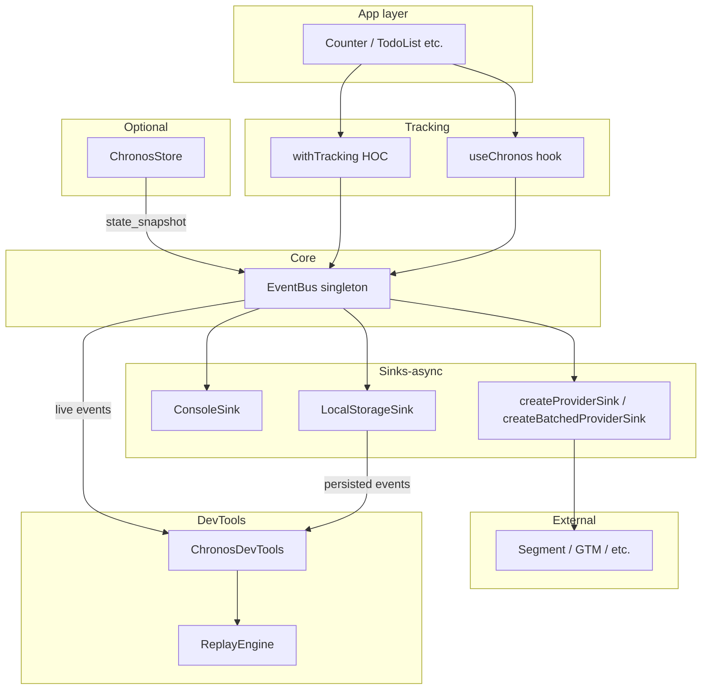
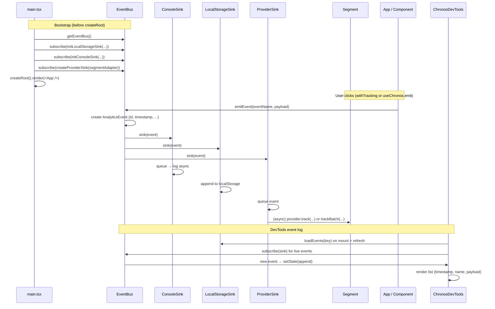
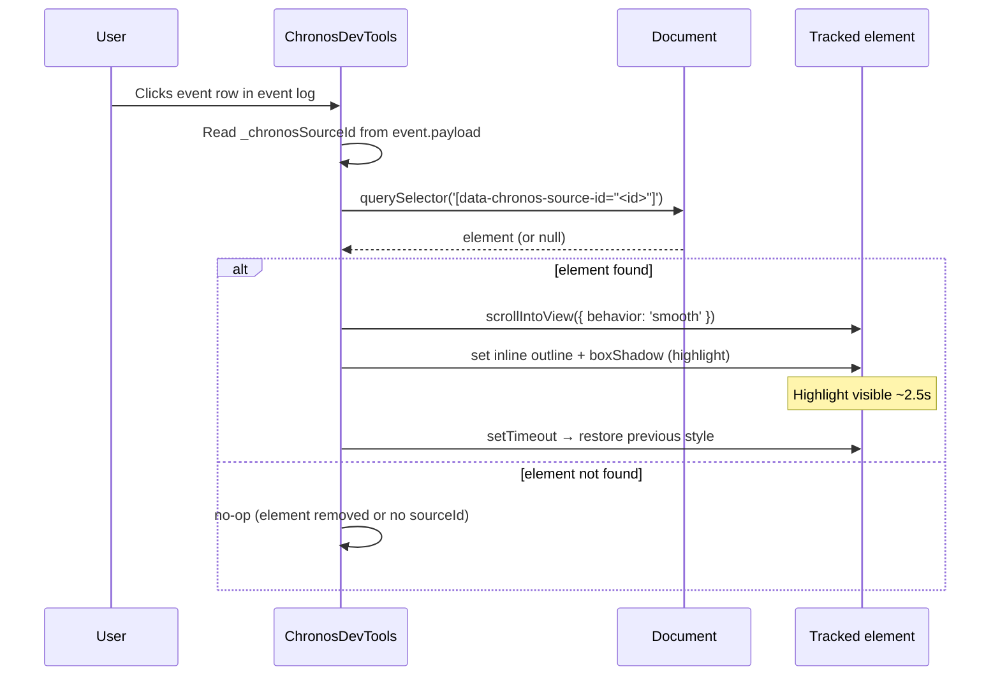

# Chronos Analytics

Event sourcing for the frontend — high-fidelity event tracking and an event log with timestamps. Use with React 18+ and TypeScript. No Redux required.

---

## How it works

### Component diagram

The following diagram shows the main pieces of Chronos and how they connect. Your app components emit events via **useChronos** or **withTracking**; the **EventBus** broadcasts every event to all registered **sinks**. Sinks log to the console, persist to localStorage, or forward to an external provider (e.g. Segment)—all asynchronously so the bus never blocks. On page unload or when offline, unsent provider events are stored in localStorage and replayed when the app loads or comes back online. **ChronosDevTools** subscribes to the bus for live updates and reads persisted events for the event log. Optionally, **ChronosStore** emits `state_snapshot` events on each state change.



### Sequence diagram: bootstrap and emit

**Bootstrap:** The app registers sinks with the EventBus before mounting so every event is captured. **Emit:** When a user interacts (e.g. click), `useChronos().emit()` or `withTracking` calls `emitEvent`; the EventBus notifies all sinks synchronously. Each sink then processes the event without blocking: Console and provider sinks queue work and run it asynchronously; LocalStorage appends in the same tick. The provider sink (if configured) forwards to Segment in the next tick or in batches; unsent events on unload/offline are stored in localStorage and replayed on load/online.



### Sequence diagram: click event row to highlight source element

When using **withTracking**, each wrapped element gets a `data-chronos-source-id` attribute and events carry `_chronosSourceId` in the payload. Clicking a row in ChronosDevTools looks up the DOM element and temporarily highlights it.



---

## Install

```bash
pnpm add chronos-analytics
# or
npm install chronos-analytics
```

**Peer dependencies:** `react` and `react-dom` (>= 18).

---

## Quick start

### 1. Register sinks before your app mounts

Register the event bus and sinks **before** `createRoot().render()` so every event (including the first) is captured.

```tsx
// main.tsx
import {
  getEventBus,
  initConsoleSink,
  initLocalStorageSink,
} from 'chronos-analytics'
import React from 'react'
import ReactDOM from 'react-dom/client'
import App from './App'

const eventBus = getEventBus()
initLocalStorageSink(eventBus, { key: 'chronos-events', maxEvents: 1000 })
initConsoleSink(eventBus) // optional; logs events to console asynchronously

ReactDOM.createRoot(document.getElementById('root')!).render(
  <React.StrictMode>
    <App />
  </React.StrictMode>
)
```

### 2. Emit events from components

**Option A — useState only (simplest):** Use `useChronos()` to get `emit` and call it when something happens. No store or reducer.

```tsx
// Counter.tsx (from examples/demo-simple)
import { useChronos, withTracking } from 'chronos-analytics'
import { useState } from 'react'

function Button(props: React.ButtonHTMLAttributes<HTMLButtonElement>) {
  return <button {...props} />
}

const TrackedButton = withTracking(Button, 'counter_click')

export function Counter() {
  const [count, setCount] = useState(0)
  const { emit } = useChronos()

  const increment = () => {
    setCount((c) => c + 1)
    emit('counter_change', { action: 'increment', value: count + 1 })
  }

  const decrement = () => {
    setCount((c) => c - 1)
    emit('counter_change', { action: 'decrement', value: count - 1 })
  }

  return (
    <section>
      <p>{count}</p>
      <TrackedButton onClick={increment}>+1</TrackedButton>
      <TrackedButton onClick={decrement}>-1</TrackedButton>
    </section>
  )
}
```

**Option B — ChronosStore (useReducer):** When you want a single store that also emits `state_snapshot` events (so they appear in the event log), use `createChronosStore`.

```tsx
// store.ts (from examples/demo)
import { createChronosStore } from 'chronos-analytics'

type AppState = { counter: number; todos: Todo[] }
type AppAction =
  | { type: 'INCREMENT' }
  | { type: 'DECREMENT' }
  | { type: 'ADD_TODO'; payload: { id: string; text: string } }
  // ...

const reducer = (state: AppState, action: AppAction): AppState => {
  switch (action.type) {
    case 'INCREMENT': return { ...state, counter: state.counter + 1 }
    case 'DECREMENT': return { ...state, counter: state.counter - 1 }
    // ...
    default: return state
  }
}

const initialState: AppState = { counter: 0, todos: [] }

export const { ChronosStoreProvider, useChronosStore } =
  createChronosStore(reducer, initialState)
```

```tsx
// App.tsx (from examples/demo)
import { ChronosDevTools } from 'chronos-analytics'
import { ChronosStoreProvider } from './store'
import { Counter } from './components/Counter'
import { TodoList } from './components/TodoList'

export default function App() {
  return (
    <ChronosStoreProvider>
      <Counter />
      <TodoList />
      <ChronosDevTools />
    </ChronosStoreProvider>
  )
}
```

```tsx
// Counter.tsx (from examples/demo — uses store)
import { withTracking } from 'chronos-analytics'
import { useChronosStore } from '../store'

const TrackedButton = withTracking(Button, 'counter_click')

export function Counter() {
  const [state, dispatch] = useChronosStore()
  return (
    <section>
      <p>{state.counter}</p>
      <TrackedButton onClick={() => dispatch({ type: 'INCREMENT' })}>+1</TrackedButton>
      <TrackedButton onClick={() => dispatch({ type: 'DECREMENT' })}>-1</TrackedButton>
    </section>
  )
}
```

### 3. withTracking HOC

Wrap any clickable component to automatically emit an analytics event on click, then run the original `onClick`.

```tsx
const TrackedButton = withTracking(Button, 'counter_click')
// Clicks emit eventName 'counter_click' with payload; then the original onClick runs.
```

### 4. Event log (ChronosDevTools)

Render `ChronosDevTools` to show a minimizable event log (timestamp, event name, payload). Events are loaded from localStorage and updated live. Collapse it to a bubble with an event-count badge.

```tsx
import { ChronosDevTools } from 'chronos-analytics'

<ChronosDevTools />
```

---

## Integrating with Segment

Chronos does not depend on Segment. To send Chronos events to Segment (or any other provider), implement the `IAnalyticsProvider` interface and subscribe a **provider sink** to the event bus.

### 1. Implement an adapter for your existing Analytics

If you already have a Segment `Analytics` instance (e.g. from `@segment/analytics-next`), wrap it so it matches `IAnalyticsProvider`:

```ts
// adapters/segmentChronosAdapter.ts
import type { IAnalyticsProvider } from 'chronos-analytics'
import { analytics } from '../analytics' // your existing Segment Analytics instance

export const segmentChronosAdapter: IAnalyticsProvider = {
  track: (eventName, properties) => analytics.track(eventName, properties),
  page: (screenName, properties) => analytics.page(screenName, properties),
  identify: (userId, traits) => analytics.identify(userId, traits),
  group: (groupId, traits) => analytics.group(groupId, traits),
}
```

### 2. Subscribe the provider sink at bootstrap

Register the sink **before** your app mounts (e.g. in the same place you call `initLocalStorageSink`). Use `createProviderSink` so that every Chronos event (except `state_snapshot`) is forwarded to Segment.

```tsx
// main.tsx
import {
  getEventBus,
  initConsoleSink,
  initLocalStorageSink,
  createProviderSink,
} from 'chronos-analytics'
import { segmentChronosAdapter } from './adapters/segmentChronosAdapter'

const eventBus = getEventBus()
initLocalStorageSink(eventBus, { key: 'chronos-events', maxEvents: 1000 })
initConsoleSink(eventBus)

// Forward Chronos events to Segment (skip internal state_snapshot events)
eventBus.subscribe(
  createProviderSink(segmentChronosAdapter, {
    filter: (e) => e.eventName !== 'state_snapshot',
  })
)

ReactDOM.createRoot(document.getElementById('root')!).render(<App />)
```

### 3. Optional: filter or reshape events

You can filter which events go to Segment or change their name/properties:

```ts
eventBus.subscribe(
  createProviderSink(segmentChronosAdapter, {
    filter: (e) => e.eventName !== 'state_snapshot' && e.eventName !== 'internal_debug',
    mapToTrack: (e) => ({
      eventName: e.eventName,
      properties: {
        ...(typeof e.payload === 'object' && e.payload ? (e.payload as Record<string, unknown>) : {}),
        ...e.metadata,
        chronosEventId: e.id,
        chronosTimestamp: e.timestamp,
      },
    }),
  })
)
```

Result: All events emitted via `useChronos().emit()` or `withTracking` (and, if you use it, non–state_snapshot events from ChronosStore) are also sent to Segment. The event log and replay stay in Chronos; Segment only receives live events.

### 4. Async sending and unsent events (unload / offline)

Provider sinks always send events **asynchronously** so `EventBus.emit()` never blocks. On **page unload** (navigation, close, refresh) or when the app is **offline**, unsent events are stored in **localStorage** and **replayed** when the app loads again or when the browser goes back online. Use **`createBatchedProviderSink`** for high event volume or when your provider supports batch (e.g. Segment `/v1/batch`).

```tsx
import {
  getEventBus,
  createBatchedProviderSink,
} from 'chronos-analytics'
import { segmentChronosAdapter } from './adapters/segmentChronosAdapter'

const eventBus = getEventBus()
eventBus.subscribe(
  createBatchedProviderSink(segmentChronosAdapter, {
    batchSize: 10,
    flushIntervalMs: 5000,
    useIdleCallback: true,
    unsentEventsStorageKey: 'chronos-unsent-events', // default; used for unload/offline replay
  })
)
```

For fewer outbound requests (e.g. Segment’s [batch API](https://segment.com/docs/connections/sources/catalog/libraries/server/http-api#batch)), implement **`trackBatch`** on your adapter. Chronos will call it with an array of `{ eventName, properties }` instead of calling `track()` per event:

```ts
// adapters/segmentChronosAdapter.ts
import type { IAnalyticsProvider, TrackPayload } from 'chronos-analytics'

export const segmentChronosAdapter: IAnalyticsProvider = {
  track: (eventName, properties) => analytics.track(eventName, properties),
  trackBatch: (events: TrackPayload[]) => {
    // e.g. POST https://api.segment.io/v1/batch with batch: events.map(e => ({ type: 'track', event: e.eventName, properties: e.properties }))
    return sendSegmentBatch(events)
  },
  page: (screenName, properties) => analytics.page(screenName, properties),
  identify: (userId, traits) => analytics.identify(userId, traits),
  group: (groupId, traits) => analytics.group(groupId, traits),
}
```

---

## API overview

| Export | Description |
|--------|-------------|
| `getEventBus()` | Singleton event bus; use to register sinks. |
| `useChronos()` | Hook that returns `{ emit(eventName, payload?, metadata?) }`. |
| `initConsoleSink(eventBus)` | Log every event to the console asynchronously. |
| `initLocalStorageSink(eventBus, options)` | Persist events to localStorage (key, maxEvents). |
| `loadEvents(storageKey?)` | Read persisted events (e.g. for custom UIs). |
| `createProviderSink(provider, options)` | Sink that forwards events asynchronously to an `IAnalyticsProvider` (e.g. Segment). Unsent events on unload/offline are stored in localStorage and replayed on load/online. |
| `createBatchedProviderSink(provider, options)` | Sink that queues events and sends in batches asynchronously; unsent events on unload/offline stored in localStorage and replayed on load/online. Use with `trackBatch` (e.g. Segment batch API) for fewer requests. |
| `createChronosStore(reducer, initialState)` | Returns `{ ChronosStoreProvider, useChronosStore }`; emits `state_snapshot` on each state change. |
| `withTracking(Component, eventName?)` | HOC: on click, emit event then call original onClick. |
| `ChronosDevTools` | Minimizable event log (and bubble with badge). |
| `ReplayEngine` | Optional; holds events for custom log UIs. |

---

## Examples in this repo

- **`examples/demo`** — Uses `createChronosStore` (useReducer) and `withTracking`. Full panel event log.
- **`examples/demo-simple`** — Uses only `useState` and `useChronos` / `withTracking`. No store.

From the repo root:

```bash
pnpm install
pnpm --filter chronos-demo dev        # demo with store (port 5174)
pnpm --filter chronos-demo-simple dev # demo with useState only (port 5175)
```

---

## Library structure

The package is built from `src/`: types, EventBus, `useChronos`, sinks, optional ChronosStore, `withTracking`, ReplayEngine, and ChronosDevTools. Sinks live under `src/lib/sinks/`: shared utilities (scheduling, env checks), provider helpers (event→payload mapping, send to provider), unsent-events localStorage persistence, and the individual sink implementations (Console, LocalStorage, createProviderSink, createBatchedProviderSink). The public API is re-exported from `src/index.ts`.

---

## License

MIT
